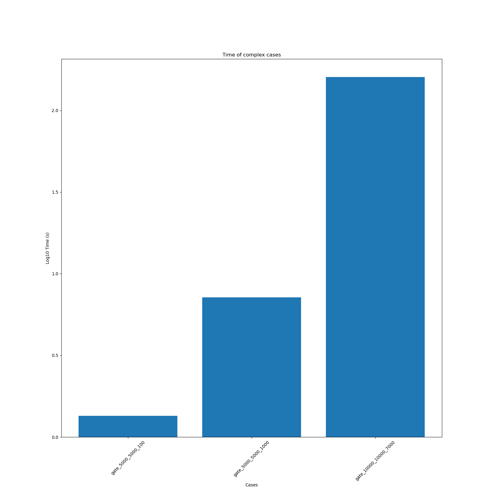
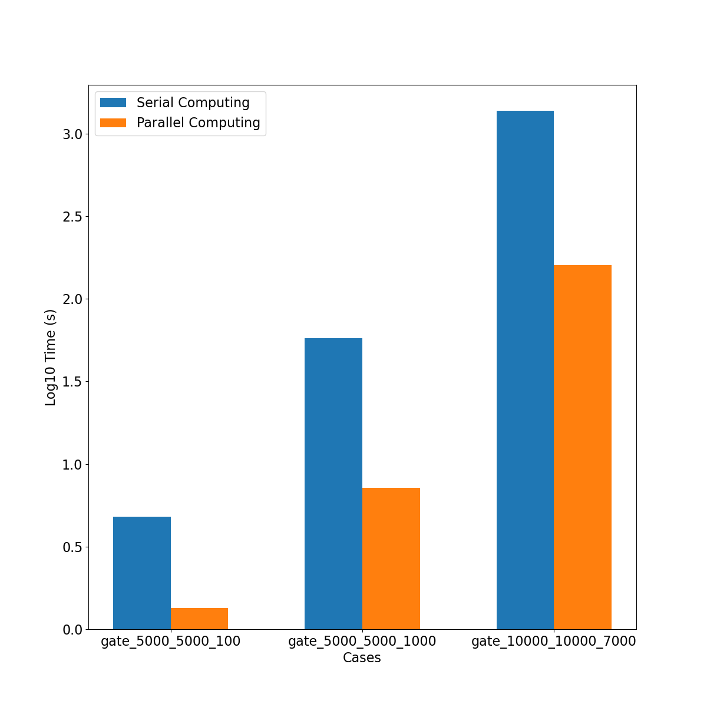
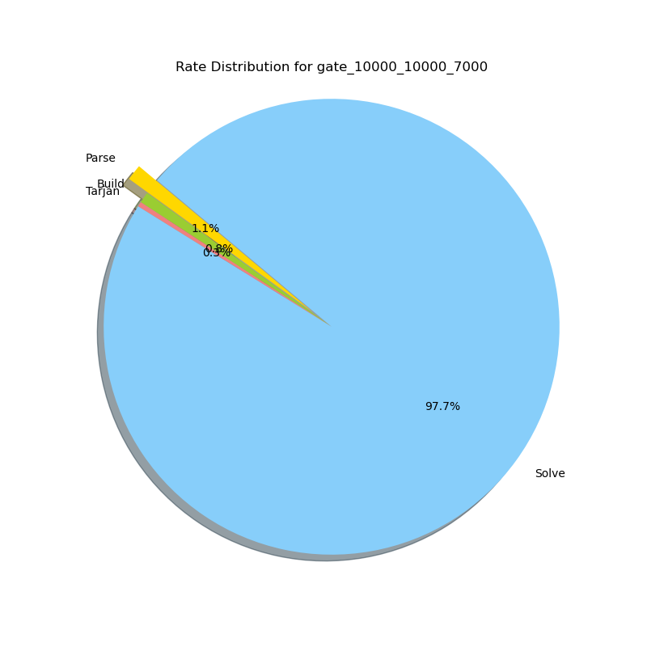

## File structure:
```                                                                                  
┌── doc.pdf                                                                             
├── README.md                                                                                         
├── result_5.pdf                                                                                   
├── result_5.v                                                                                     
├── run.sh
├── modinfo                                        # Combinational logic information obtained from verilog file
├── Soln                                           # Solutions to part of the cases
├── testcase_with_answer                           # Available Cases that you can find solutions in 'Soln'
├── testcase_without_answer                        # Cases without solutions for problem 4
└── work                                                                                           
    ├── bin                                                                                        
    │   └── logicLoopChecker                       # The executable file                           
    ├── build.sh                                   # The build script                                                 
    ├── src                                                                                        
    │   ├── checker.py                             # Our script to check the result of problem 1-3   
    │   ├── checker_R4.py                          # Our script to check the result of problem 4        
    └   └── logicLoopChecker                       # Our source code                               
                                                                                 
```


## Run:

```
$ ./run.sh ${CASE_DIR}/case.v # The results will be generated in pwd
 ```

## Note:

Executable file `logicLoopChecker` which is **pre-built**. If you want to build it:

```
$ cd work/
$ ./build.sh # This will compile the source code and copy the executable file to
```

## Results:

### Simple Cases


### Complex Cases


### Enhenced performance by parallel computing


### Time Distribution

